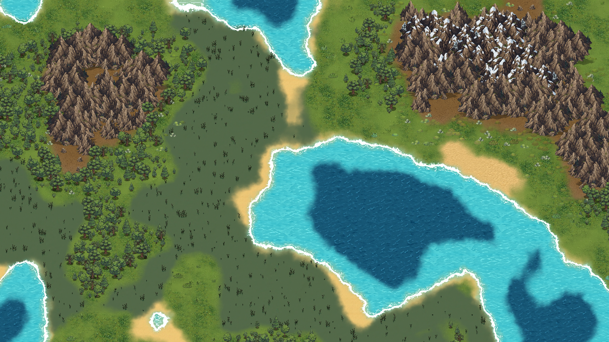

# Eden



Générateur de cartes 2D procédurales en vue de dessus, fait avec **Godot 4.3**.

Deux bruits de Perlin (élévation et humidité) déterminent le biome de chaque case :
eau profonde, eau, sable, marais, désert, plaine, forêt, collines, montagne, neige.

- Chaque biome a sa texture de sol, avec des variantes réparties par plaques pour éviter
  les répétitions.
- Les sols se fondent les uns dans les autres, sans frontière en escalier.
- Une écume blanche borde toutes les côtes.
- Des objets sont dispersés selon le biome : arbres, buttes, touffes, rochers, quenouilles
  du marais. Les buttes et les touffes prennent la couleur du sol sous elles.
- Les montagnes reposent sur un sol rocheux semé de rochers et projettent une ombre.

## Lancer

Ouvrir le projet dans Godot 4.3 et lancer la scène principale (`main.tscn`), ou F5 depuis
VS Code avec l'extension *godot-tools*.

| Touche | Action |
|---|---|
| R | nouvelle carte |
| I | mode île |
| E | activer / désactiver les effets graphiques (fondus, écume, variantes…) |
| ZQSD / flèches | déplacer la caméra |
| Molette | zoomer |
| Clic droit maintenu | faire glisser la vue |

## Organisation

```
main.tscn                  scène principale
world/
  world_generator.gd       génération : bruit, choix des biomes, pose des tuiles,
                           fondus, écume et objets
  biome.gd                 définition d'un biome (seuils, texture, objets)
  prop_scatter.gd          dessin des objets du décor et de leurs ombres
  camera_controller.gd     caméra
  shaders/                 variantes, fondus entre sols, écume, teintes
  assets/                  atlas utilisés par le jeu (+ sources/ : images d'origine)
```

Les biomes se règlent dans l'inspecteur du nœud `World` (liste `biomes`). Les fondus,
l'écume et la teinte au pied des montagnes ont leurs propres groupes de réglages dans le
même inspecteur.
